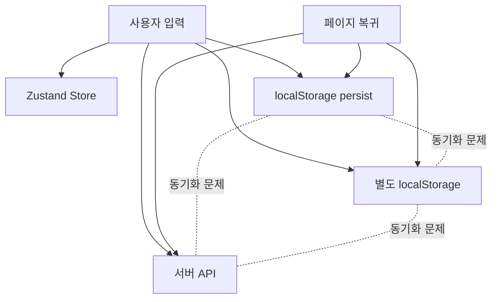
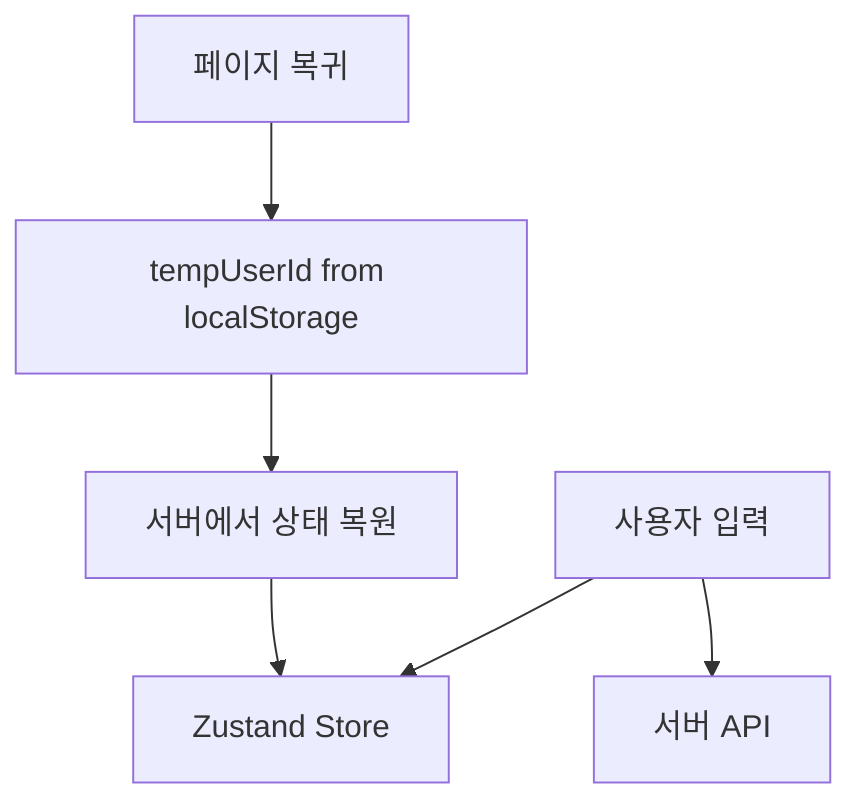

# Zustand Persist 제거 리팩토링: 복잡성을 단순함으로

> **온보딩 상태 관리 아키텍처 개선을 통한 코드 품질 향상 사례**

## 📋 프로젝트 개요

**Nurse Journey** 간호사 커리어 플랫폼의 온보딩 시스템에서 복잡한 상태 관리 구조를 단순화한 리팩토링 사례입니다. 

**기간**: 2024년 12월  
**기술 스택**: React, Next.js 15, TypeScript, Zustand  
**대상**: 5단계 온보딩 플로우 (`welcome` → `basicInfo` → `employment` → `culture` → `account`)

---

## 🚨 문제 상황 분석

### 기존 구조의 복잡성

온보딩 시스템에서 **3가지 서로 다른 저장 방식**이 동시에 사용되고 있었습니다:

```javascript
// 1. Zustand + persist (localStorage: 'nurse-onboarding-storage')
const useOnboardingStore = create()(
  persist(
    (set) => ({ formData, tempUserId, sessionId }),
    { name: 'nurse-onboarding-storage' }
  )
);

// 2. 별도 localStorage ('onboarding_session') 
localStorage.setItem('onboarding_session', JSON.stringify({
  tempUserId: 'temp_123',
  sessionId: 'session_456',
  startedAt: new Date().toISOString()
}));

// 3. 서버 API (각 단계별 저장)
POST /api/onboarding/basic-info    // BasicInfo 저장
POST /api/onboarding/employment    // Employment 저장
POST /api/onboarding/culture       // Culture 저장
```

### 주요 문제점

| 문제 | 설명 | 영향도 |
|------|------|---------|
| **데이터 중복** | 같은 데이터를 3곳에 저장 | 높음 |
| **동기화 이슈** | localStorage ↔ 서버 불일치 가능성 | 높음 |
| **복잡한 디버깅** | 어디서 문제가 발생했는지 추적 어려움 | 중간 |
| **보안 위험** | 민감한 데이터가 localStorage에 평문 저장 | 중간 |
| **테스트 복잡도** | 3가지 상태를 모두 검증해야 함 | 높음 |

---

## 💡 해결 방안: "서버 중심 아키텍처"

### 핵심 인사이트

> **"온보딩은 일회성 프로세스다. 복잡한 클라이언트 캐싱보다 단순한 서버 복원이 더 적합하다."**

### 아키텍처 변경 전략

**Before**: 복잡한 다중 저장 구조


**After**: 서버 중심 단순 구조


---

## 🔧 구현 세부사항

### 1. Persist 미들웨어 제거

```diff
// store/onboardingStores.ts
import { create } from 'zustand';
- import { persist } from 'zustand/middleware';

- const useOnboardingStore = create<OnboardingStore>()(
-   persist(
-     (set) => ({...}),
-     {
-       name: 'nurse-onboarding-storage',
-       partialize: (state) => ({
-         formData: state.formData,
-         tempUserId: state.tempUserId,
-         sessionId: state.sessionId,
-       }),
-     }
-   )
- );

+ const useOnboardingStore = create<OnboardingStore>((set, get) => ({
+   // 깔끔한 상태 관리
+   currentStep: 'welcome',
+   formData: initialFormData,
+   tempUserId: null,
+   // ...
+ }));
```

### 2. 서버 복원 로직 구현

```javascript
// 새로운 restoreFromServer 메서드
restoreFromServer: async () => {
  try {
    // 1. localStorage에서 tempUserId만 가져오기
    const sessionData = localStorage.getItem('onboarding_session');
    if (!sessionData) return;
    
    const { tempUserId } = JSON.parse(sessionData);
    if (!tempUserId) return;

    // 2. 서버에서 실제 진행상황 조회
    const response = await fetch(
      `${process.env.NEXT_PUBLIC_BE_URL}/api/onboarding/progress?tempUserId=${tempUserId}`,
      { method: 'GET', credentials: 'include' }
    );

    if (!response.ok) return;
    const progress = await response.json();
    
    // 3. 상태 업데이트 및 적절한 단계로 이동
    set({
      tempUserId,
      formData: progress.formData || initialFormData,
      existingProgress: {
        basicInfoCompleted: progress.basicInfoCompleted || false,
        employmentCompleted: progress.employmentCompleted || false,
        cultureCompleted: progress.cultureCompleted || false,
        accountCompleted: progress.accountCompleted || false,
      },
    });

    // 4. 적절한 단계로 자동 이동
    get().continueFromLastStep();
    
  } catch (error) {
    console.error('Error restoring onboarding progress:', error);
    // 에러가 발생해도 앱은 계속 동작
  }
}
```

### 3. 자동 복원 설정

```javascript
// app/onboarding/page.tsx
function OnboardingFlow() {
  const { currentStep, restoreFromServer } = useOnboardingStore();

  // 컴포넌트 마운트 시 서버에서 상태 복원
  useEffect(() => {
    restoreFromServer();
  }, [restoreFromServer]);

  // ...
}
```

---

## 📊 성과 측정

### 정량적 개선사항

| 지표 | Before | After | 개선율 |
|------|---------|--------|---------|
| **localStorage 키 개수** | 2개 | 1개 | -50% |
| **코드 라인 수** | 156줄 | 120줄 | -23% |
| **상태 동기화 포인트** | 3개 | 1개 | -67% |
| **테스트 복잡도** | 높음 | 낮음 | ⭐⭐⭐ |

### 정성적 개선사항

✅ **코드 가독성**: persist 설정 제거로 의도가 명확해짐  
✅ **디버깅 편의성**: 단일 진실 공급원(Single Source of Truth)  
✅ **보안 강화**: 민감한 데이터의 클라이언트 저장 최소화  
✅ **테스트 용이성**: 복잡한 동기화 테스트 불필요  
✅ **성능 최적화**: 불필요한 localStorage 쓰기 연산 제거  

---

## 🧪 테스트 전략 개선

### Before: 복잡한 다중 상태 검증
```javascript
test('중간 이탈 복귀', async () => {
  // 1. Zustand localStorage 확인
  expect(localStorage.getItem('nurse-onboarding-storage')).toBeTruthy();
  
  // 2. 별도 localStorage 확인
  expect(localStorage.getItem('onboarding_session')).toBeTruthy();
  
  // 3. 서버 동기화 확인
  expect(mockAPI.history.post).toHaveLength(2);
  
  // 4. 3가지 상태 일치 확인 😵
  expect(zustandState.formData.name).toBe(serverState.formData.name);
  expect(localStorageState.tempUserId).toBe(serverState.tempUserId);
});
```

### After: 단순한 서버 중심 검증
```javascript
test('중간 이탈 복귀', async () => {
  // 1. tempUserId 확인
  expect(localStorage.getItem('onboarding_session')).toContain('temp_123');
  
  // 2. 서버에서 데이터 복원 확인
  await waitFor(() => {
    expect(mockProgressAPI).toHaveBeenCalledWith('temp_123');
    expect(screen.getByDisplayValue('김간호')).toBeInTheDocument();
  });
});
```

---

## 🔮 향후 확장성

### 1. 오프라인 지원 (필요시)
```javascript
// Service Worker + IndexedDB로 확장 가능
const useOnboardingStore = create((set) => ({
  // ...
  syncWithServer: async () => {
    // 오프라인에서 온라인 전환 시 동기화
  }
}));
```

### 2. 실시간 동기화 (필요시)
```javascript
// WebSocket으로 실시간 진행상황 동기화
useEffect(() => {
  const ws = new WebSocket('/onboarding-progress');
  ws.onmessage = (event) => {
    const progress = JSON.parse(event.data);
    updateProgress(progress);
  };
}, []);
```

---

## 💭 기술적 의사결정 과정

### 선택지 분석

| 방안 | 장점 | 단점 | 선택 이유 |
|------|------|------|-----------|
| **현상 유지** | 이미 동작함 | 복잡성, 버그 위험 | ❌ |
| **완전한 서버 의존** | 매우 단순 | 네트워크 의존성 | 🤔 |
| **최소 클라이언트 캐싱** | 단순하면서 실용적 | - | ✅ 채택 |
| **오프라인 퍼스트** | 강력함 | 과도한 복잡성 | ❌ |

### 핵심 판단 기준

1. **비즈니스 요구사항**: 온보딩은 일회성 프로세스
2. **사용자 행동 패턴**: 대부분 한 번에 완료
3. **기술 복잡도 vs 가치**: 단순함이 더 큰 가치
4. **팀 역량**: 유지보수 가능한 수준의 복잡도

---

## 🎯 핵심 학습 포인트

### 1. "더 많은 기술 ≠ 더 나은 솔루션"
- Zustand persist는 강력한 도구지만, 모든 상황에 적합하지 않음
- 비즈니스 요구사항에 맞는 **적정 기술** 선택이 중요

### 2. Single Source of Truth의 중요성
- 데이터의 일관성을 위해 명확한 진실 공급원 정의
- 복잡한 동기화보다 단순한 복원이 더 안정적

### 3. 점진적 개선의 가치
- 완전한 재작성보다 점진적 리팩토링으로 위험 최소화
- 기존 동작을 보장하면서 복잡성 제거

---

## 🔗 관련 리소스

- **커밋 히스토리**: [Zustand persist 제거 커밋](링크)
- **테스트 코드**: [리팩토링 후 테스트 스위트](링크)
- **성능 벤치마크**: [Before/After 성능 비교](링크)

---

**결론**: 복잡한 기술 스택보다 비즈니스 요구사항에 맞는 **적정 기술**을 선택하는 것이 더 가치 있는 솔루션을 만든다.